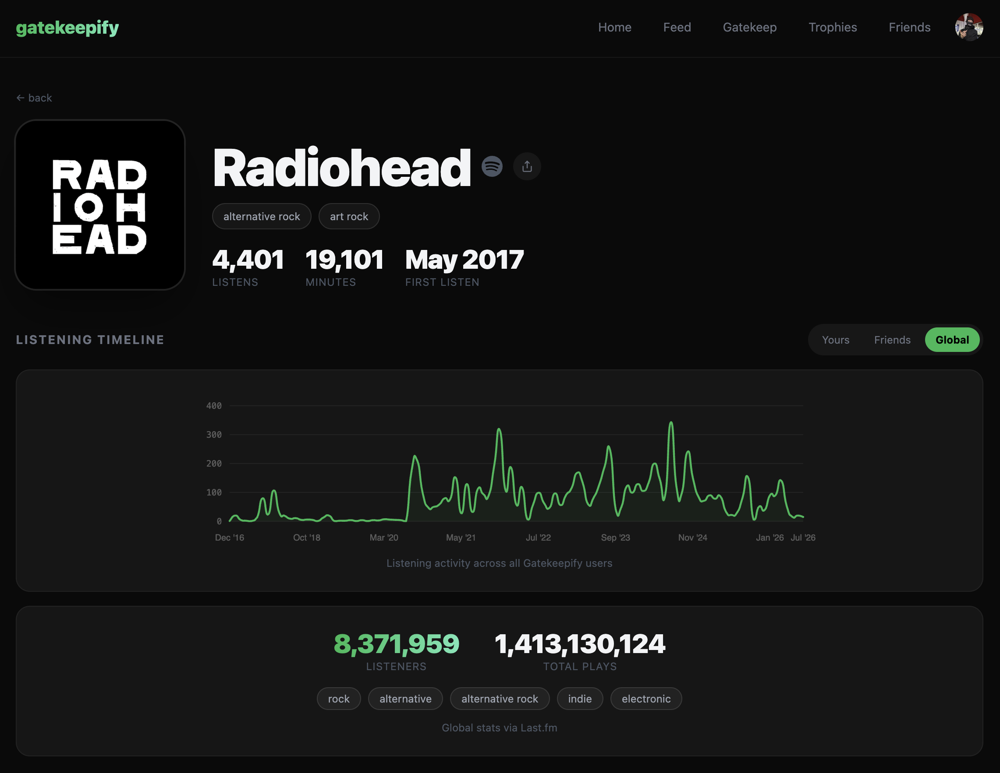
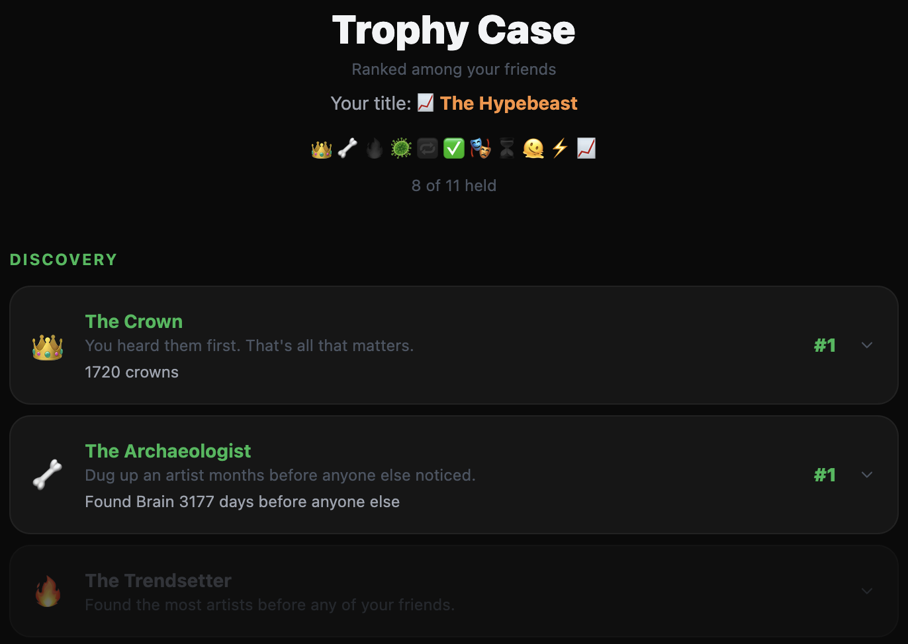
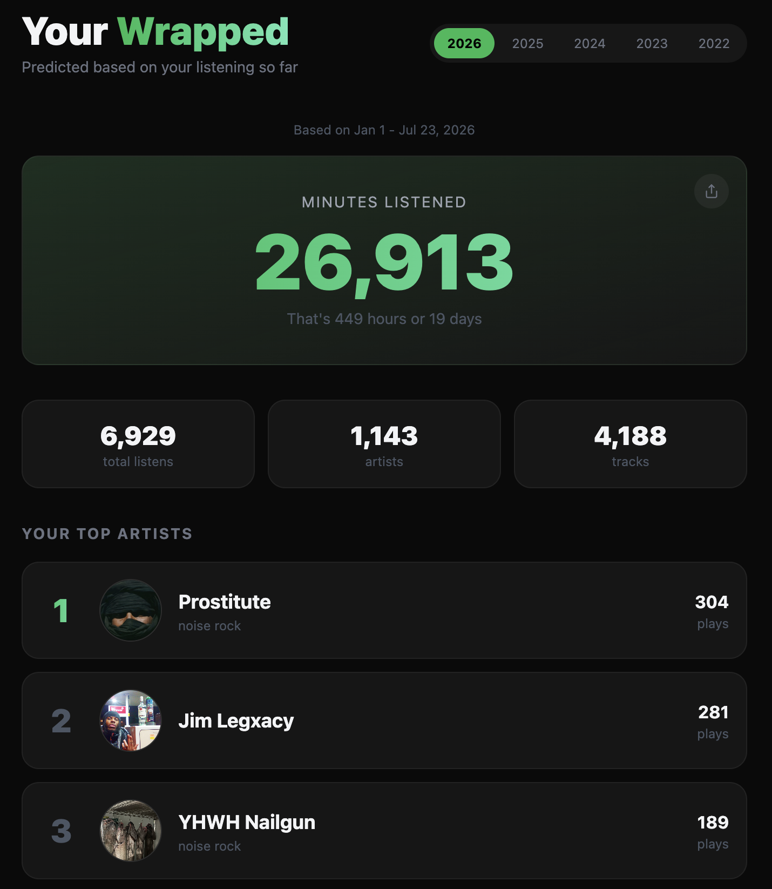
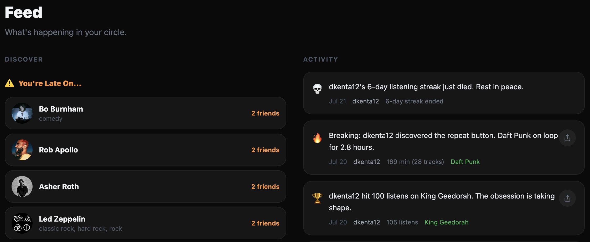

# Gatekeepify

**Prove you listened first.** 🎧

You've been saying it for years: *you* were into that artist before everyone else. Gatekeepify gives you the receipts. Track your Spotify listening history, stack it against your friends', and settle the debate with timestamps instead of vibes.

> "I've listened to Radiohead 847 times since 2017. You started in 2021. Sit down."

<!-- SCREENSHOT: Landing page / hero shot — the "Prove you listened first" sign-in screen -->

---

## Why Gatekeepify?

Because being right isn't enough — you need to *prove* it. Gatekeepify turns your listening history into a competitive sport, backed by real timestamped data, and lets you flex on your friends with charts, trophies, and shareable brag cards.

It's performative. It's a little bit annoying. That's the whole point.

---

## Features

### 🏆 Gatekeep your friends
Search any artist or track and instantly see who in your friend group listened first — and how badly you're beating (or losing to) them. Every listen is tagged **verified** or **self-reported**, so there's no faking your way to the top of the leaderboard.

<!-- SCREENSHOT: Gatekeep comparison — artist search results with "first listener" leaderboard -->

### 📈 Artist deep-dives
Every artist gets their own page: a smooth listening-timeline chart (you vs. friends vs. the world), Last.fm global stats, your personal gatekeep standing, and a challenge card to call out a friend directly.

  

### 🥇 Trophies & awards
Earn **11 competitive awards** across four tiers — Discovery, Devotion, Taste, and Dynamic. Claim the **Crown** for an artist, dig up deep cuts as the **Archaeologist**, or get roasted with **The Basic** anti-award. Each award has an expandable leaderboard so you can see exactly where you rank.

  

### ⚔️ Head-to-head
Pick a friend and go stat-for-stat in a side-by-side showdown with visual bars. Total domination has never been so quantifiable.

<!-- SCREENSHOT: Head-to-head comparison page -->

### 🔮 Predicted Wrapped
Don't wait until December. Get your year-in-review any time, for any year you have data — top artists, tracks, genres, and the numbers to back up your taste.

  

### 🧭 Discover & feed
See what your friends are freshly into, find the artists you're embarrassingly *late* on, and catch rising artists before they blow up. A live activity feed keeps the trash talk flowing.

  

### 📤 Bring your whole history
Sign in with Spotify and start tracking immediately, or upload your full Spotify data export to unlock *years* of listening history. The upload runs in the background with a progress bar and enriches every track as it goes.

<!-- SCREENSHOT: Upload page — progress bar mid-import -->

### 📲 Share the flex
One tap generates a clean 1080×1080 share card — artist art, your headline stat, and Gatekeepify branding — ready for your story. Available on artist pages, Wrapped, and shareable feed events.

<!-- SCREENSHOT: Generated share card example -->

---

## Get started

1. **Sign in with Spotify** — no account setup, no passwords.
2. **(Optional) Upload your data export** for full historical depth.
3. **Add your friends** with a one-tap invite link.
4. **Start gatekeeping.**

Add it to your home screen on mobile for a full-screen, app-like experience.

---

## Tech Stack

For the curious (click to expand)

**Backend:** Python · FastAPI · SQLAlchemy · PostgreSQL · Celery + Redis · spotipy

**Frontend:** Next.js · TypeScript · Tailwind CSS

**Integrations:** Spotify API · Last.fm API

**Deployment:** Railway (backend + PostgreSQL + Redis) · Vercel (frontend)

